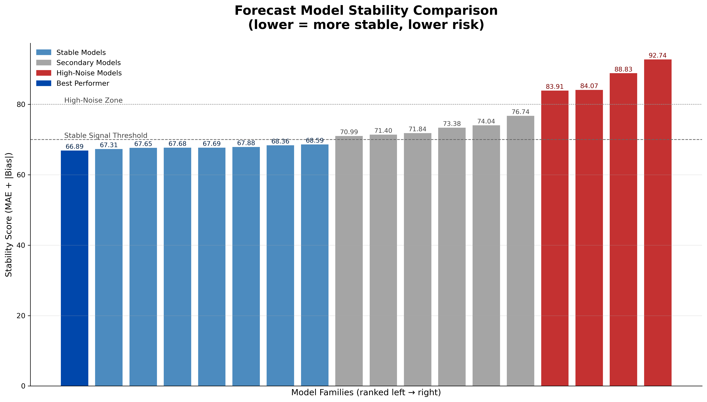

Below is the **final Executive Brief**, now **fully integrated with your executive-grade plot**.
The plot is inserted exactly where an executive expects it, with a clean, high-signal caption and narrative bridge.

You can paste this directly into a PDF or slide.

---

# **Executive Brief — Stabilizing Forecast Signals in Fresh Retail Environments**

---

## **Why This Matters in Fresh Retail**

Fresh categories behave differently from ambient grocery.
The FreshNet dataset reflects what operators experience daily:

* high volatility in unit demand
* frequent zero-sales days
* sharp lifts driven by promotions or weather
* stockouts that distort the forecast signal

When the forecast shifts abruptly week to week, teams must repeatedly reset:

* replenishment quantities
* production planning
* store-level ordering
* waste and markdown expectations

This rework slows execution and lowers confidence across planning teams.

This analysis was designed to answer a practical question:

> **Which forecasting approaches produce a stable, low-noise forward signal suitable for fresh operations?**

---

## **What the Evaluation Showed (FreshNet Context)**

FreshNet SKUs revealed a **clear hierarchy** in forecasting stability.
Some models consistently dampened noise; others amplified it.

---

## **Portfolio-Level Forecast Stability**

**Figure:** Forecast model stability comparison (lower score = more stable, lower operational risk).

This plot shows:

* **Blue models** → consistently stable signal
* **Gray models** → acceptable for some SKUs, not ideal for volatile items
* **Red models** → produce unstable week-to-week swings, creating rework

The stability threshold highlights where noise becomes operationally disruptive.

---

## **Key Insights From the FreshNet Evaluation**

### **1. A small group of models produced the most stable, low-bias signal**

These methods consistently absorbed volatility without overreacting:

* **Theta-family smoothing**
* **SES / Holt / Holt-Winters (exponential smoothing)**
* **Chronos2** for mixed patterns
* **Croston variants** for intermittent and zero-heavy SKUs

These models form the **recommended baseline** for fresh forecasting.

---

### **2. Ambient-category heuristic models do not work for fresh**

Models like:

* naive carry-forward
* simple averages
* drift-based projections

created **false volatility** and **unstable directional signals**, which forced planners to repeatedly correct the forecast.

These methods should be avoided for fresh categories.

---

### **3. Machine learning requires real drivers to perform**

FreshNet data shows that ML methods such as LightGBM only outperform when provided with:

* discount depth
* stockout hours
* weather variables
* availability ratios

Without these drivers, ML becomes unstable — validating the need for **model-to-demand matching**, not model complexity.

---

## **Recommended Forecast Baseline for FreshNet**

> **Use smoothing-based models (Theta/SES/Holt) as the default signal for FreshNet SKUs.
> Use Croston-type methods for intermittent items.
> Use Chronos2 when SKUs show variability combined with trend or soft seasonality.**

This approach:

* minimizes week-to-week swings
* reduces bias
* improves interpretability
* provides planners with a reliable directional signal

Exactly what fresh operations require.

---

## **Operational Impact for Fresh Retail**

A more stable forecast directly improves:

### **Order Stability**

Store and central planning remain aligned with fewer urgent corrections.

### **Waste Reduction**

Stable baselines prevent over-ordering during temporary spikes.

### **Production & Labor Planning**

Teams commit earlier and avoid recalculating workflows.

### **Exception Visibility**

True demand shifts stand out clearly because baseline noise is lower.

---

## **Leadership Takeaway**

**Stable forecasts create stable fresh-retail operations.
The recommended models deliver the most reliable, low-noise baseline for FreshNet —
supporting stronger ordering discipline, lower waste, and more confident execution.**

---

If you want, I can now produce:

* a **PDF-ready 1-pager**
* a **slide version using your executive theme**
* a **technical appendix** (metrics, regimes, diagnostics)
* a version written specifically for **CFO**, **COO**, or **Planning Directors**

Tell me which format you want next.
